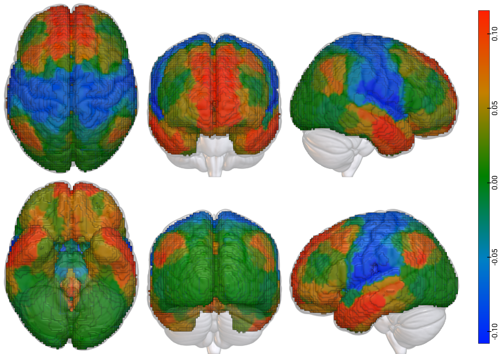

# Intro to MRIcroGL scripting

Introduction to scripting with MRIcroGL to make nice plots of brain maps with less effort.

# Why MRIcroGL

There are many nice options to view NIfTI images and to make good looking plots of the
brain. One of the natural choices when using Python is to use [nilearn.plotting](https://nilearn.github.io/stable/plotting/index.html).
I really like nilearns plotting functionality, since it is very easy to use indeed,
well documented, and seemlessly integrates into any python-based workflows/scripting tasks.

However, I personally also like the flexibility and user-interface that MRIcroGL
provides when viewing images interactively, and recently also discovered its python
scripting interface, which makes it very easy to run a set of repetitive tasks in the
viewers and create nice images. Another feature of MRIcroGL I absolutely love, is
the rendering of 3D volumes rather than just plotting of slices at specific coordinates.
It just looks fancy!

# Set up for the tutorial

```
git clone https://github.com/LeSasse/intro_to_mricrogl_scripting.git
cd intro_to_mricrogl_scripting  
```

# Install MRIcroGL

Download the version that works for your system from the [MRIcroGL NITRC page](https://www.nitrc.org/projects/mricrogl).
You can also download from the [rordenlab GitHub page](https://github.com/rordenlab/MRIcroGL)
via command line by running (the link points to a linux version -- check out the rordenlab GitHub Page for other versions):
```
curl -fLO https://github.com/rordenlab/MRIcroGL/releases/latest/download/MRIcroGL_linux.zip
```
I can provide some instructions on how I like to set it up on my system (Ubuntu 20.04),
but check what works for your system. Instructions for a [mac can be found in this
video by Andy Jahn](https://www.youtube.com/watch?v=Htid2mbyav8). He also provides a
nice series of videos on using MRIcroGL's UI to analyse your results (and many
other useful neuroimaging videos, so check him out).

```
unzip MRIcroGL_linux.zip
```
Then I move or copy the folder into `/usr/local` where MRIcroGL will try to find
its ressources/files when starting up.
```
sudo cp -r MRIcroGL /usr/local/.
```
To be able to use the MRIcroGL binary from anywhere, add the `MRIcroGL` directory
to `$PATH` in your `zshrc` (or `bashrc` or some similar file):
```
export PATH=$PATH:/usr/local/MRIcroGL
```
Make sure to source the `zshrc` or start up a new terminal:
```
source ~/.zshrc
```
Now, running `MRIcroGL` should open up the viewer.
However, for ease of use I like to set an alias in addition, since I don't like
switching between the upper and lower cased letters. Again, in your `zshrc` add:
```
alias mricrogl="MRIcroGL"
```
and again make sure to source the `zshrc` or start up a new terminal.
```
source ~/.zshrc
```
Now, running `mricrogl` should start up the program also. From now on, I will only use `mricrogl`
in any of the instructions. Note, that if you didn't set the alias, you can and should
run `MRIcroGL` instead.

I have added a [script that I use to install MRIcroGL](https://github.com/LeSasse/intro_to_mricrogl_scripting/blob/main/code/install.sh)
with my preferred settings.

# Using the program for interactive viewing

Most features of the program when interactively viewing NIfTI images are covered
by the series of videos that Andy Jahn made (linked above) and by the useful videos
provided by Chris Rorden himself on his youtube channel (for example: [MRIcroGL Introduction](https://www.youtube.com/watch?v=CL9X3zPUYN0)).
For this reason, I will not go into the interactive viewing myself.

# Using MRIcroGL for scripting

MRIcroGL provides some instructions and help regarding scripting [here](https://github.com/rordenlab/MRIcroGL/blob/master/PYTHON.md).
Here, I want to provide a few useful step-by-step guide to use some of its scripting features
with some example data. Although I am sure much more is possible than what I show here,
it will set you up for a good start and already provide you some powerful possibilities.

MRIcroGL is extremely powerful (in my opinion) and you can see whats possible simply
by playing around with some of the examples provided within it. Simply in the MRIcroGL
click on `scripting` > `Templates` and test some of the options. To me, the most
interesting plots are different versions of the mosaic plots and the rendered versions
of the NIfTI images.

Overall, you can write your scripts using Python code. However, it is not run via
the typical python interpreter but via MRIcroGL. So, as the instructions linked above
state, you can run a script (for example `my_script.py`) using `mricrogl my_script.py`.
(You can of course also run it in the MRIcroGL interface as well, but I typically
find it easier to run things directly from the command line, which also ensures
that the plotting works in exactly the same way each time, without you fiddling in
the GUI.)

Typically, I like to first make a startup script for MRIcroGL that sets my defaults
for the interactive viewer. That is, you can make a script called `startup.py`
and place it in the `/usr/local/MRIcroGL/Resources/script/` directory
and then MRIcroGL will always run this script when you start the application.

You can write a new script either by clicking on `scripting` > `new` in the MRIcroGL
UI. This will start a new file in MRIcroGL's editor with the following default template:
```
import gl
import sys

print(sys.version)
print(gl.version())

# set defaults and load a template
gl.resetdefaults()
```
I like to use my own text editor so, I typically write a script in my own editor first
and then open it in MRIcroGL later.

In particular, I prefer a white background over the black default for the main
screen as well as for the colorbar:
```
gl.loadimage("mni152")

# set up background colors and colorbar
gl.backcolor(255, 255, 255) # white
gl.colorbarposition(2)
gl.colorbarcolor(255, 255, 255, 0) # the 0 indicates the `alpha` parameter i.e. transparency level
gl.colorbarsize(0.03) # width

# view and cross-hairs
gl.linewidth(1)

```
The full version of my startup script is under `code/startup.py`.

In the following, I provide some example data and some example code to make your own plots
using MRIcroGL so you can get the basics.

# Example Data

As an example, I have created functional connectivity (FC) gradients of a group average
FC dataset. The data is exctracted from the [AOMIC PIOP1 study](https://nilab-uva.github.io/AOMIC.github.io/)
and gradients are extracted from the FC matrix using [brainspace](https://brainspace.readthedocs.io/en/latest/index.html).
If you are interested in exactly how I extract the gradients check out my [gradiator
package](https://github.com/LeSasse/gradiator).

The gradient components are mapped back into NIfTI images using the atlas originally
used to extract FC (a combination of the Schaefer400 and Tian32-subcortical atlases).
The NIfTI images can be found in this repository in the
`data/gradients/AOMIC_PIOP1_AVG_CONNECTOME_Schaefer400Tian32_gradients/approach-dm/kernel-normalized_angle`
directory.

I typically do all of my plots with similar settings to my `startup` script. So snippets
from that `startup` file will not be included here in the text but for all examples
I provide full code in the `code` directory. Further, the code shown here
always assumes that it is run from inside the `code` directory, so elsewhere
paths may be broken.

## Plot a basic mosaic of the first gradient component

The full script for this plot can be found in `code/01_plot_slices_gradient_one.py`.

Importantly, I typically have a line that defines the size and location of the window:
```
# plot window size and position (left, top, width, height)
gl.windowposition(2000, 200, 3010, 1000)
```
Then I define a path to the image I want to load and plot:
```
# path to the gradient directory
gradient_file_dir = (
    "../data/gradients/AOMIC_PIOP1_AVG_CONNECTOME_"
    "Schaefer400Tian32_gradients/approach-dm/kernel-normalized_angle"
)

# filename of the first component
gradient = "spars-0.9_appr-dm_kernel-normalized_angle_comp-1_gradient.nii.gz"
nii = os.path.join(gradient_file_dir, gradient)
```
You can load the gradient as an overlay:
```
gl.overlayload(nii)
```
The opacity function changes
the opacity of the image loaded which in our case is the mni152 template loaded in the beginning. It does not change the
opacity of the overlay (there is another function for that).
I like to make the template slightly translucent, so that you can still see the template
but the overlay has somewhat more intense colors.
```
gl.opacity(0, 40)
```
Load one of the colormaps included in MRIcroGL (you can also add more colormaps)
If you want, although I won't cover it here yet).
```
gl.colorname(1, "blue2red")
```
The next function creates a mosaic plot. It takes a "mosaic string" and parses it
to create the image. Essentially rows are separated by ";". There are different
letters to denote different views {'A' (Axial), 'C' (Coronal), 'S' (Sagittal),
'R' (Render)} and numbers to denote coordinates, directions, and coordinates.
This may seem confusing, but MRIcroGL makes it very easy to create your own 
"mosaic strings" interactively.
```
gl.mosaic("A R 0 C R 0 S R 0; A R -0 C R -0 S R -0")
```
Save a png of the plot you have created:
```
gl.savebmp(f"../images/gradient_one.png")
```
And Done! The result should look something like this:

